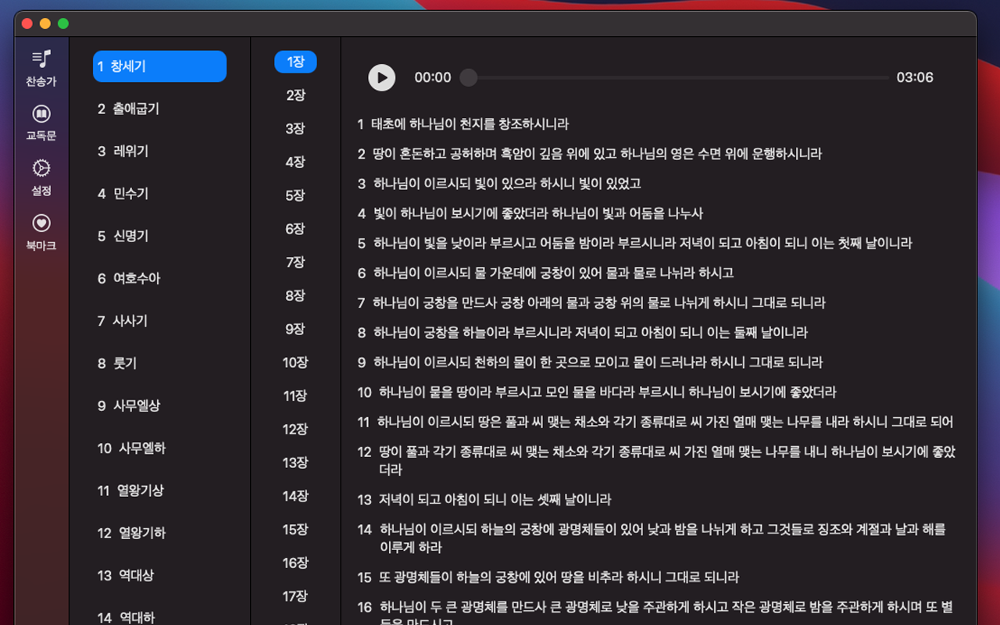

# 데일리 성경

iOS 및 macOS 성경 앱입니다.


## App Features

- [x] 성경, 찬송가, 교독문, CCM을 볼 수 있습니다.
- [x] 다크모드를 지원합니다.

|                     기능                     |                     설정                     |                공유 및 북마크                |                    북마크                    |                 오디오 구입                  |
| :------------------------------------------: | :------------------------------------------: | :------------------------------------------: | :------------------------------------------: | :------------------------------------------: |
|  |  |  |  |  |


|                     성경                     |                    찬송가                    |                    교독문                    |
| :------------------------------------------: | :------------------------------------------: | :------------------------------------------: |
|  |  |  |


## Getting Started

```
$ git clone https://github.com/Goeun1001/Bible-Pro
$ cd Bible-Pro
$ pod install
```


## Requirements

- iOS 13+
- macOS 12+
- Swift 5
- CocoaPods


## Contribution

I'm waiting for your contribution.
